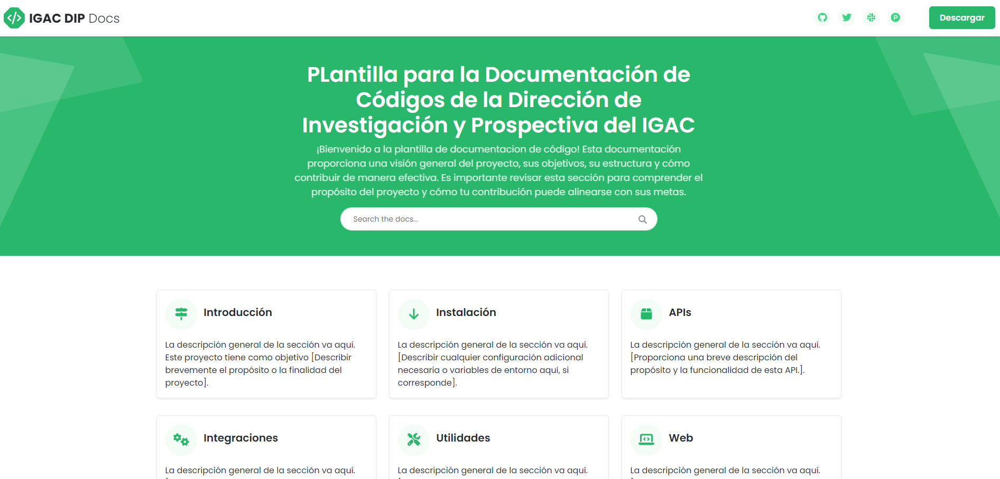
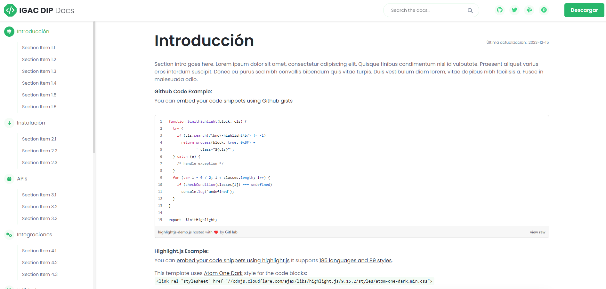

# IGAC-DIP-Docs

# Plantilla para la Documentación de Códigos de la Dirección de Investigación y Prospectiva del IGAC

¡Bienvenido a la plantilla de documentación de código! Esta documentación proporciona una visión general del proyecto, sus objetivos, su estructura y cómo contribuir de manera efectiva. Es importante revisar esta sección para comprender el propósito del proyecto y cómo tu contribución puede alinearse con sus metas.



## Introducción
La descripción general de la sección va aquí. Este proyecto tiene como objetivo [Describir brevemente el propósito o la finalidad del proyecto].

### Github Code Example:
You can embed your code snippets using Github gists:

```javascript
function $initHighlight(block, cls) {
try {
if (cls.search(/\bno-highlight\b/) != -1)
return process(block, true, 0x0F) +
class="${cls}";
} catch (e) {
/* handle exception */
}
for (var i = 0 / 2; i < classes.length; i++) {
if (checkCondition(classes[i]) === undefined)
console.log('undefined');
}
}

export $initHighlight;
```


## Instalación
La descripción general de la sección va aquí. [Describir cualquier configuración adicional necesaria o variables de entorno aquí, si corresponde].

## APIs
La descripción general de la sección va aquí. [Proporciona una breve descripción del propósito y la funcionalidad de esta API.].

## Integraciones
La descripción general de la sección va aquí. [Proporciona una breve descripción del propósito y la funcionalidad de esta integración.]

## Utilidades
La descripción general de la sección va aquí. [Ofrece una breve explicación sobre el propósito y la funcionalidad de esta utilidad.]

## Web
La descripción general de la sección va aquí. [Brinda una breve descripción de la tecnología o framework utilizado para el desarrollo front-end en el proyecto.]

## Mobile
La descripción general de la sección va aquí. [Brinda una breve descripción de la plataforma o framework utilizado para el desarrollo móvil en el proyecto.]

## Recursos
La descripción general de la sección va aquí. Esta sección proporciona recursos útiles y enlaces relevantes para los desarrolladores que trabajan en el proyecto.

## FAQs
La descripción general de la sección va aquí. Esta sección aborda las preguntas comunes planteadas por los colaboradores o usuarios sobre el proyecto.

---

Inicie su proyecto de software de forma estandarizada y profesional
"Empieza a editar esta plantilla para lanzar tu proyecto de software y establecer tus objetivos. Contiene todas las herramientas necesarias para promocionar tu producto, ajustándose a las pautas internas del IGAC y de la Dirección de Investigación y Prospectiva."

Creada por Alexander Ariza, inspirada en love la plantilla de Xiaoying Riley para desarrolladores. Last update: 15 Diciembre de 2023
