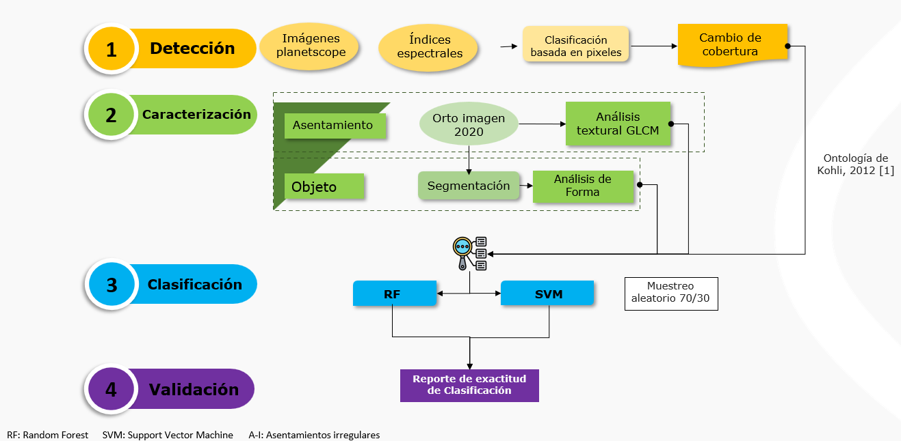

# IGAC-DIP-Docs

# Proyecto de Investigación: Identificación de asentamientos irregulares desde la extracción de cubiertas con imágenes de sensores remotos
¡Bienvenido a la plantilla de documentación de código! Esta documentación proporciona una visión general del proyecto, sus objetivos, su estructura y cómo contribuir de manera efectiva. Es importante revisar esta sección para comprender el propósito del proyecto y cómo tu contribución puede alinearse con sus metas.

## Introducción
Las ciudades, son espacios de oportunidades, con crecimientos acelerados que de no seguirse adecuadamente propicia espacios de precariedad para sus ciudadanos; los espacios precarios cuentan con poca información de su evolución en el tiempo; no obstante, múltiples acciones a nivel mundial se han tomado para atender espacios de carencia (asentamientos irregulares), combinando tecnologías satelitales de Observación de la Tierra (EO) para reconocerlos. Los avances se han direccionado en múltiples vertientes, generando avances en “mapear” esta dinámica territorial para generar datos confiables y entregarlos a tomadores de decisiones
El objetivo del proyecto es presentar una metodologia que aporte en la identificación de este tipo de espacios para asi generar información confiable sobre estos. El presente documento se expone entonces el proceso de identificación de los asentamientos irregulares haciendo uso de imagenes de sensores remotos y del proceso de clasificación a través del software Google Earth Engine (GEE). 



## Elementos del codigo
El codigo se organiza en 4 partes: 

En las fases 1 y 2 se busca generar rasters que contribuyan a mejorar la clasificación de los asentamientos, en la fase 1 se genera un raster de cambio de cobertura en dos epocas e indices espectrales (NDVI, NDWI y PISI*), en la fase 2 se extraen parametros texturales a partir de la Gray-Level Co-ocurrence Matriz (GLCM) y de la segmentación de imagenes, con estos elementos se pasa a la fase 3 de clasificación, en donde se entrena el modelo a partir de puntos de muestra clave para entrenar modelos de Machine Learning (Random Forest y Suport Vector Machine). En la ultima fase se evaluan los resultados obtenidos a partir de metricas de exactitud posicional.  

### Github Code Example:
You can embed your code snippets using Github gists:

```javascript
//Calculo indices espectrales
var ndvi_ibague = mosaic_ibague_2023.normalizedDifference(['b4', 'b1']);
var ndwi_ibague = mosaic_ibague_2023.normalizedDifference(['b2', 'b4']);
var nir_i = mosaic_ibague_2023.select('b4');
var red_i = mosaic_ibague_2023.select('b1');
var green_i = mosaic_ibague_2023.select('b2');
var blue_i = mosaic_ibague_2023.select('b3');
var pisi_ibague = blue_i.multiply(0.8192).subtract(nir_i.multiply(0.5735)).add(0.0750).rename('PISI');

//Calculo parametros texturales GLCM
var square = ee.Kernel.square({radius: 4});

// Compute entropy and display.
var entropy = nir_i.entropy(square);
//Map.addLayer(entropy,
//             {min: 1, max: 5, palette: ['0000CC', 'CC0000']},
//             'entropy');
var glcm_ibague = nir_i.glcmTexture({size: 3});

//Seleccionar capas de la GLCM

var contrast = glcm_ibague.select('b4_contrast');
var variance = glcm_ibague.select('b4_var');
var homogenity = glcm_ibague.select('b4_idm');
var Entropia = glcm_ibague.select('b4_ent');

//SNIC Segmentacion
 var segment1 = ee.Algorithms.Image.Segmentation.SNIC({
    image: image,
    compactness: 1,
    connectivity: 8 ,
    neighborhoodSize: 256,
    seeds: seeds
    });
  var imageObject = segment1.select(['b.*']);
//Clasificación

//Imagen a clasificar
var imageStacking3 = ee.Image.cat([
  imageObject1,
  ndvi2,
  ndwi,
  pisi,
  contrast,
  variance,
  homogenity,
  Entropia
  ]);
print('Img 4B + Media + I.Espect+I.Text',imageStacking3);

///Definir puntos de entrenamiento
var puntos_train = PuntosEntrenam;
var puntos_train = puntos_train.randomColumn();
///Definir puntos de validacion
var puntos_val = PuntosValid;

///Definir los atributos para el entrenamiento de los puntos de entrenamiento
var trained = ImageStacking5.select(bandsName).sampleRegions({
  collection: puntos_train,
  scale: 10,
  properties: ['Class'],
  tileScale: 16,
});

//Definir el clasificador RANDOM FOREST 
var Classifier = ee.Classifier.smileRandomForest(100).train(trained, 'Class', bandsName);

//Imagen clasificada RANDOM FOREST 
var LandCover = ImageStacking5.classify(Classifier).rename('Clasificado');

print(LandCover);

Map.addLayer(LandCover, {min:1, max:7,palette: ['ff690e','580105','2fff0c','369121','ffff00','22dcde','002060']}, 'ClasificacionRF');

print('Results of trained classifier RF', Classifier.explain());

//Validacion
//Metricas de precisión del modelo RANDOM FOREST
//precision del entrenamiento
var AccuracyTrain = Classifier.confusionMatrix();
print('Exactitud total CLASIF (Entrenamiento) RF ', AccuracyTrain.accuracy());
print('Training error matrix RF', AccuracyTrain);

//Obtener las metricas para la validación del modelo

var validation = LandCover.sampleRegions({
  collection: puntos_val,
  properties: ['Class'],
  scale: 10,
});
print('validation RF', validation);

//Matrix de confusión RANDOM FOREST
var errorMatrixRF = validation.errorMatrix({
  actual: 'Class',
  predicted: 'Clasificado',
});

print('Error matriz RF', errorMatrixRF);
print('Exactitud general de validación RF', errorMatrixRF.accuracy());
print('Exactitud del Consumidor UA RF (Validacion)', errorMatrixRF.consumersAccuracy());
print('Exactitud del Productor PA RF (Validacion)', errorMatrixRF.producersAccuracy());
print('Coeficiente Kappa RF', errorMatrixRF.kappa());


```

## Última Versión
**Bootstrap 5 v3.0** - 2023-06-23

[Changelog](https://themes.3rdwavemedia.com/bootstrap-templates/startup/coderdocs-free-bootstrap-5-documentation-template-for-software-projects/?target=changelog)

## Caracteristicas

-  Requiere el uso de una cuenta de Google Earth Engine
-  Se requiere 2 imagenes de dos temporalidades para el estudio de cambio de cobertura
-  Compatible with all modern browsers
  
## Instalación
Se necesita de tener insumos bases como lo son imagenes de dos temporalidades y puntos muestrales (entrenamiento y validación) de las clases definidas (1.Suelo desnudo; 2.Vias; 3.Vegetación Herbacea; 4.Vegetación Arbustiva; 5.Asentamiento Formal; 6.Asentamiento Informal: 7.Agua )

## APIs
La descripción general de la sección va aquí. [Proporciona una breve descripción del propósito y la funcionalidad de esta API.].

## Integraciones
La descripción general de la sección va aquí. [Proporciona una breve descripción del propósito y la funcionalidad de esta integración.]

## Utilidades
La descripción general de la sección va aquí. [Ofrece una breve explicación sobre el propósito y la funcionalidad de esta utilidad.]

## Web
La descripción general de la sección va aquí. [Brinda una breve descripción de la tecnología o framework utilizado para el desarrollo front-end en el proyecto.]

## Mobile
La descripción general de la sección va aquí. [Brinda una breve descripción de la plataforma o framework utilizado para el desarrollo móvil en el proyecto.]

## Recursos
La descripción general de la sección va aquí. Esta sección proporciona recursos útiles y enlaces relevantes para los desarrolladores que trabajan en el proyecto.

## FAQs
La descripción general de la sección va aquí. Esta sección aborda las preguntas comunes planteadas por los colaboradores o usuarios sobre el proyecto.

---

Inicie su proyecto de software de forma estandarizada y profesional
"Empieza a editar esta plantilla para lanzar tu proyecto de software y establecer tus objetivos. Contiene todas las herramientas necesarias para promocionar tu producto, ajustándose a las pautas internas del IGAC y de la Dirección de Investigación y Prospectiva."
Creada por [Alexander Ariza](https://gist.github.com/Alexanderariza), inspirada en love la plantilla de [Xiaoy ing Riley](https://themes.3rdwavemedia.com/) para desarrolladores. Last update: 15 Diciembre de 2023
